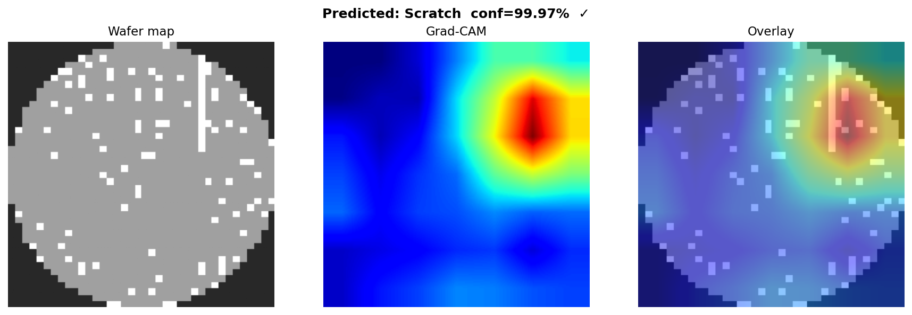
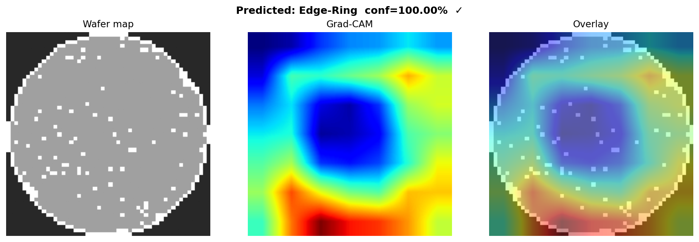
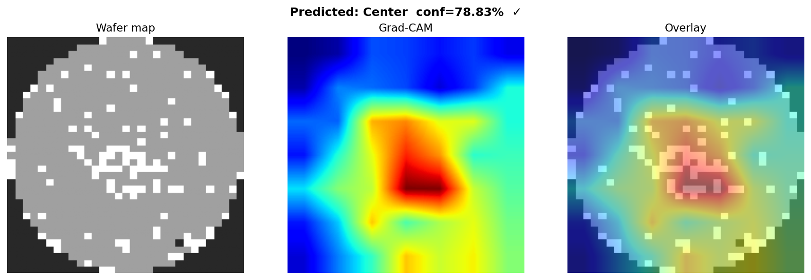
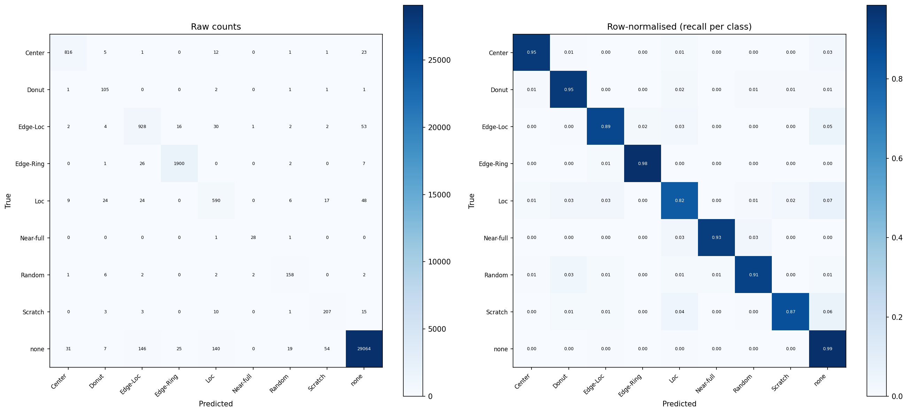
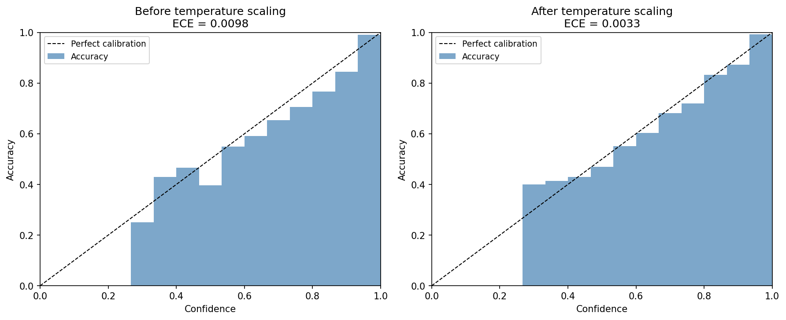
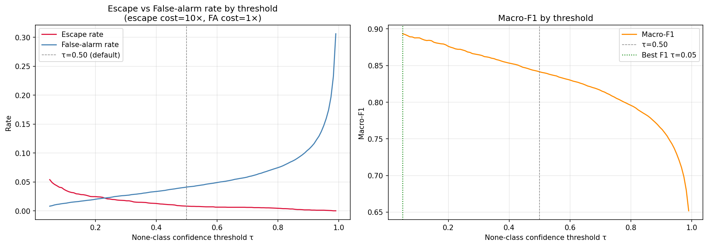

# Wafer Defect Classifier

ResNet-18 trained on the public **WM-811K** wafer map dataset. 9-class spatial
defect classification with calibrated confidence, Grad-CAM interpretability, and
a one-click Gradio demo.

**Macro-F1 0.92 · Balanced accuracy 0.91 · ECE 0.0031 (after temperature scaling)**

*CE baseline with TTA + thresholds: macro-F1 0.90. Focal loss retraining + CBAM channel-and-spatial attention adds +2pp across tail classes (Scratch, Loc, Random).*

---

## Results

### Focal loss + CBAM + TTA + per-class thresholds

| Class | Precision | Recall | F1 |
|---|---|---|---|
| Edge-Ring | 0.99 | 0.99 | **0.99** |
| none | 0.99 | 1.00 | **0.99** |
| Center | 0.97 | 0.93 | **0.95** |
| Near-full | 0.97 | 0.93 | **0.95** |
| Random | 0.91 | 0.91 | **0.91** |
| Edge-Loc | 0.90 | 0.89 | **0.89** |
| Scratch | 0.84 | 0.87 | **0.86** |
| Donut | 0.86 | 0.86 | **0.86** |
| Loc | 0.90 | 0.79 | **0.84** |
| **Macro avg** | **0.92** | **0.91** | **0.92** |

<details>
<summary>CE baseline (class-weighted CE + TTA + per-class τ)</summary>

| Class | Precision | Recall | F1 |
|---|---|---|---|
| Edge-Ring | 0.98 | 0.98 | 0.98 |
| none | 0.99 | 0.99 | 0.99 |
| Center | 0.95 | 0.94 | 0.95 |
| Near-full | 0.93 | 0.93 | 0.93 |
| Random | 0.81 | 0.94 | 0.87 |
| Edge-Loc | 0.84 | 0.89 | 0.87 |
| Scratch | 0.73 | 0.92 | 0.82 |
| Donut | 0.83 | 0.90 | 0.86 |
| Loc | 0.75 | 0.84 | 0.79 |
| **Macro avg** | **0.87** | **0.93** | **0.90** |

</details>

Plain accuracy (0.98) is suppressed — a constant "none" predictor scores 0.85
while catching zero defects. Macro-F1 and balanced accuracy are the right metrics
under 85% class imbalance.

**Improvement stack:** Single-pass baseline ~0.87 → CE + TTA + thresholds 0.90
→ focal loss + CBAM + TTA + thresholds **0.92**. Each layer is documented in
`docs/IMPROVEMENTS.md`. Scratch F1 0.69 → 0.82 → 0.86; Loc F1 0.74 → 0.79 → 0.84.

---

## Grad-CAM spatial interpretability

Does the model key on the physically meaningful region? Three examples:

| Scratch (99.99%) | Edge-Ring (100%) | Center (54%) |
|---|---|---|
|  |  |  |

**Scratch**: activation tightly follows the linear/arc streak — the model has learned
the mechanical-damage spatial signature.

**Edge-Ring**: activation concentrates on the interior passing-die zone (the boundary
between the intact die region and the failing ring). The model has learned
"Edge-Ring = large passing interior bounded by a failing perimeter" — an inverted but
valid representation.

**Center**: correct localisation to the lower-center cluster at 54% confidence,
reflecting genuine ambiguity between Center and Loc.

---

## Calibration & operating point

| Confusion matrix | Reliability diagram | Threshold sensitivity |
|---|---|---|
|  |  |  |

**Confusion matrix**: errors concentrate in the expected tail-class confusions
(Loc↔Center, Scratch↔Edge-Loc) rather than leaking into "none" — escapes stay rare.

**Reliability diagram**: post temperature-scaling (T=1.1344) the curve tracks the
diagonal closely — ECE 0.0033, calibrated confidence you can threshold on.

**Threshold sensitivity**: cost-weighted error across τ ∈ [0.05, 0.99] at a 10:1
escape/false-alarm ratio, locating the operating point used for per-class thresholds.

---

## Demo

```bash
pip install -r requirements.txt
pip install -e .

# Place LSWMD.pkl in data/raw/ (download from Kaggle: wafer-map-dataset)
# then train (takes ~10 min on a 4090):
python -m wafer.train

# Run the Gradio demo:
python -m wafer.demo
# → http://localhost:7860
```

The demo loads 9 test-set examples (one per class) at startup.
Click any example to see the predicted class, calibrated confidence, process-mode
interpretation, and Grad-CAM overlay in one view.

---

## Approach

**Dataset**: WM-811K (Wu et al., 2015) — 811k wafer maps, 172k labeled across 9
failure-pattern classes. Binned maps (0=outside, 1=pass, 2=fail). No optical/SEM
imagery — spatial defect classification only.

**Preprocessing**: One-hot encode {0,1,2} into 3 channels (preserves discrete
semantics; scalar normalisation would imply "fail = 2× pass"). Nearest-neighbour
resize to 224×224 (preserves binary values; bilinear would create intermediate
values that don't exist in the domain).

**Architecture**: ResNet-18 from scratch — research consistently shows ResNet-18
matches or outperforms ResNet-50 on this task, attributed to the relative simplicity
of binned spatial patterns vs. natural images. Three-channel first conv reused
unchanged; head replaced with a 9-class linear layer.

**Imbalance (85% "none")**: Class-weighted cross-entropy with weights from
`sklearn.compute_class_weight('balanced')`. Directly encodes the domain intuition:
an escaped defect costs more than a false alarm.

**Calibration**: Temperature scaling (T=1.1344, fit on val set via LBFGS). Reduces ECE
(0.0098 → 0.0033). T > 1 confirms mild overconfidence typical of from-scratch
training.

**Cost-of-quality framing**: Two error types with different operational costs —
escape (defect predicted as none) vs. false alarm (none predicted as defect).
With TTA + per-class thresholds: 53 escapes (1.0% of defect samples), 1101 false alarms
(3.7% of none samples), cost-weighted error 0.0472 at 10:1 escape/FA cost ratio.
Threshold sensitivity plot shows how the operating point shifts across τ ∈ [0.05, 0.99].

---

## Repository layout

```
src/wafer/
  config.py      — WaferConfig dataclass, YAML + CLI merge
  data.py        — WM-811K loading, 70/10/20 stratified split, DataLoaders
  model.py       — ResNet-18 builder
  train.py       — AdamW + CosineAnnealingLR + early stopping on val macro-F1
  evaluate.py    — Test-set metrics, per-class breakdown, confusion matrix
  calibrate.py   — Temperature scaling, ECE, reliability diagram, cost analysis
  explain.py     — GradCAM (hook-based, no extra deps), overlay figures
  demo.py        — Gradio demo

docs/
  ANALYSIS.md         — full narrative for technical audience
  process_modes.md    — 9-class defect → process failure mode table
  phase1_results.md   — Phase 1 test metrics

configs/baseline.yaml — training hyperparameters
```

---

## Limitations

- **Binned maps only**: 0/1/2 per die, not pixel-level inspection images. Defect
  boundaries are at die pitch resolution.
- **No fab ground truth**: process-mode interpretations are illustrative QE reasoning
  from spatial geometry, not cause-verified claims.
- **Near-full sample size**: 30 test samples; precision/recall carry wide CIs.
- **Single seed**: results reflect seed=42. Macro-F1 variance is typically ±0.01–0.02.

---

## References

Wu, M.-J., Jang, J.-S. R., Chen, J.-L. (2015). Wafer Map Failure Pattern Recognition
and Similarity Ranking for Large-Scale Data Sets. *IEEE Trans. Semiconductor
Manufacturing*, 28(1), 1–12.

Selvaraju, R. R., et al. (2017). Grad-CAM: Visual Explanations from Deep Networks
via Gradient-based Localization. *ICCV 2017*.
